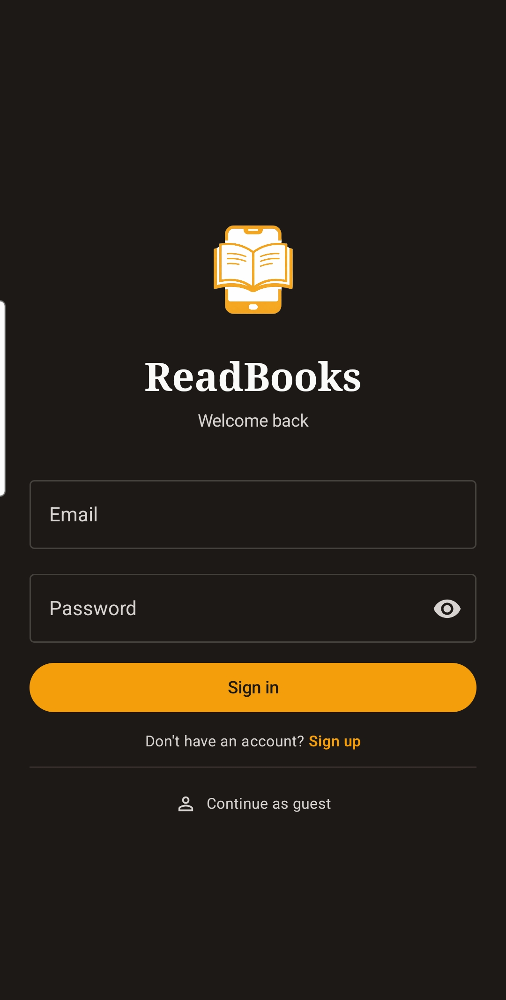
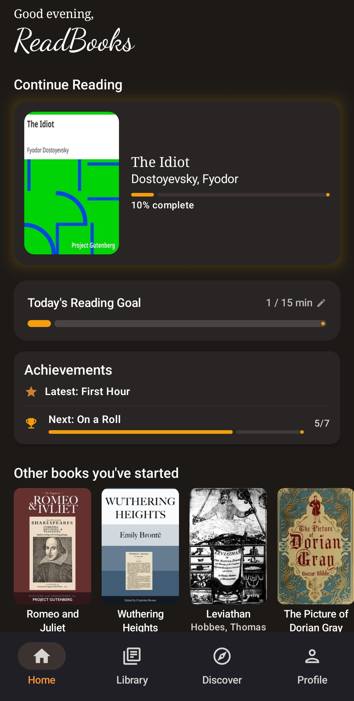
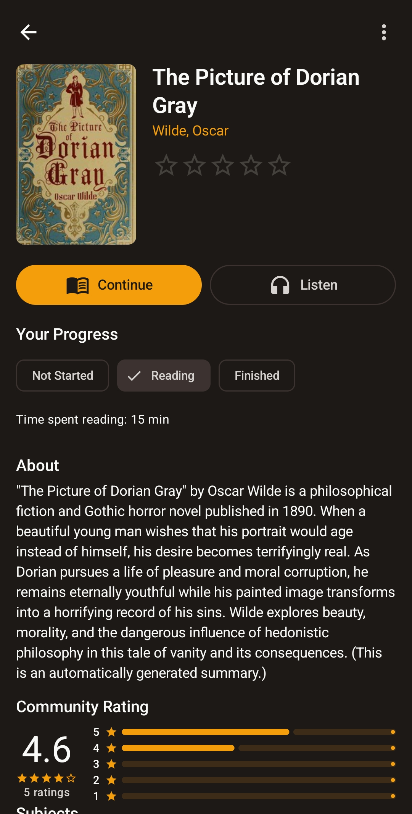
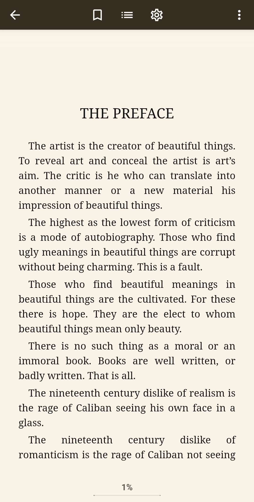

# 📚 ReadBooks

An Android ebook reader powered by [Gutendex](https://gutendex.com) and [OpenLibrary](https://openlibrary.org), with offline EPUB reading, text-to-speech, reading goals & statistics, and achievements.

> **Status:** Stable hobby project · Actively developed 

---

## Screenshots

<p align="center">
  
  
  
  
  
  
</p>

---

## Features

### 📖 Reading
- EPUB reading powered by [Readium](https://readium.org) (v3.1.2)
- Fully offline once a book is downloaded
- Customizable reader settings (font, size, theme, and more)
- Bookmarks and table of contents navigation
- Text-to-speech (TTS) with a mini player and full player sheet

### 🔍 Discover
- Browse and search thousands of free books from [Project Gutenberg](https://www.gutenberg.org) via Gutendex
- Book details including author info, descriptions, subjects, and community ratings
- Topic-based discovery and curated shelves

### 🗂️ Library
- Personal library with filter and sort options
- Collections for organising books
- Reading status tracking (to-read, currently reading, finished)

### 📊 Goals & Achievements
- Set and track reading goals
- Reading streaks and session analytics
- Achievement system with unlockable badges

### 👤 Account & Profile
- Register with email — a verification link is sent to your inbox, and tapping it opens the app directly
- Login, logout, and email verification flow
- Avatar customisation
- Profile with reading stats and achievements
- **Guest mode** — browse and read without an account; some features (profile customisation, stats tracking) require registration

### 🔔 Notifications
- Daily reading reminders via WorkManager

---

## Architecture

ReadBooks is built with **Clean Architecture** across a multi-module Gradle project:

```
app/              → Entry point, navigation, Hilt wiring
core/domain/      → Models, repository interfaces, use cases
core/data/        → Repository implementations, Room DB, DataStore, Retrofit, Readium TTS
core/ui/          → Shared Compose components and theme
core/common/      → Shared utilities (Result type, AppError)
```

### Layers

```
┌──────────────────────────────────────────┐
│                 app (UI)                 │  Compose screens · ViewModels
├──────────────────────────────────────────┤
│              core/domain                 │  Use cases · Repository interfaces · Models
├──────────────────────────────────────────┤
│               core/data                  │  Repository impls · APIs · Room · TTS
├─────────────────────┬────────────────────┤
│      core/ui        │    core/common     │  Shared components / Result & errors
└─────────────────────┴────────────────────┘
```

**Key patterns:**
- ViewModels expose `StateFlow` with sealed UI state classes
- Use cases encapsulate business logic, keeping ViewModels thin
- Repository pattern abstracts local (Room, DataStore) and remote (Retrofit) data sources
- Hilt for dependency injection throughout
- Paging 3 for paginated book discovery

### Book Sources

### Book Sources

| Source | Role |
|---|---|
| Self-hosted Gutendex | Primary catalogue, search, and book metadata |
| gutendex.com | Automatic fallback if the primary server is unavailable |
| Project Gutenberg | Serves the actual EPUB files for download |
| OpenLibrary API | Author details, covers, and supplementary metadata |

### Backend

User accounts, authentication, ratings, and synced data are handled by a companion backend (separate repository — not included here). The backend is a **Spring Boot / Kotlin** REST API, self-hosted alongside Gutendex, backed by **PostgreSQL**. Authentication uses **JWT**, and transactional emails (e.g. verification) are sent via [Resend](https://resend.com).

The app is fully usable without an account — guest mode gives access to browsing, downloading, and reading.

---

## Tech Stack

### Android App

| Category | Library / Tool |
|---|---|
| Language | Kotlin |
| UI | Jetpack Compose |
| Architecture | MVVM + Clean Architecture |
| Dependency Injection | Hilt |
| Navigation | Jetpack Navigation Compose |
| EPUB Engine | Readium Kotlin Toolkit 3.1.2 |
| Text-to-Speech | Readium TTS + Android TTS |
| Networking | Retrofit + OkHttp |
| Local Database | Room |
| Preferences | DataStore |
| Async | Kotlin Coroutines + Flow |
| Paging | Paging 3 |
| Background Work | WorkManager |
| Image Loading | Coil |

### Backend (separate repo)

| Category | Library / Tool |
|---|---|
| Language | Kotlin |
| Framework | Spring Boot |
| Database | PostgreSQL |
| Auth | JWT |
| Email | Resend |

---

## Getting Started

1. Clone the repository
   ```bash
   git clone https://github.com/fbaldhagen/readbooks.git
   ```
2. Open in Android Studio
3. Build and run on a device or emulator running **Android 8.0+ (API 26+)**

The app connects to a self-hosted Gutendex instance by default, and falls back to the public `gutendex.com` API automatically if unavailable — no configuration needed.

---

## License

This project is licensed under the [MIT License](LICENSE).
